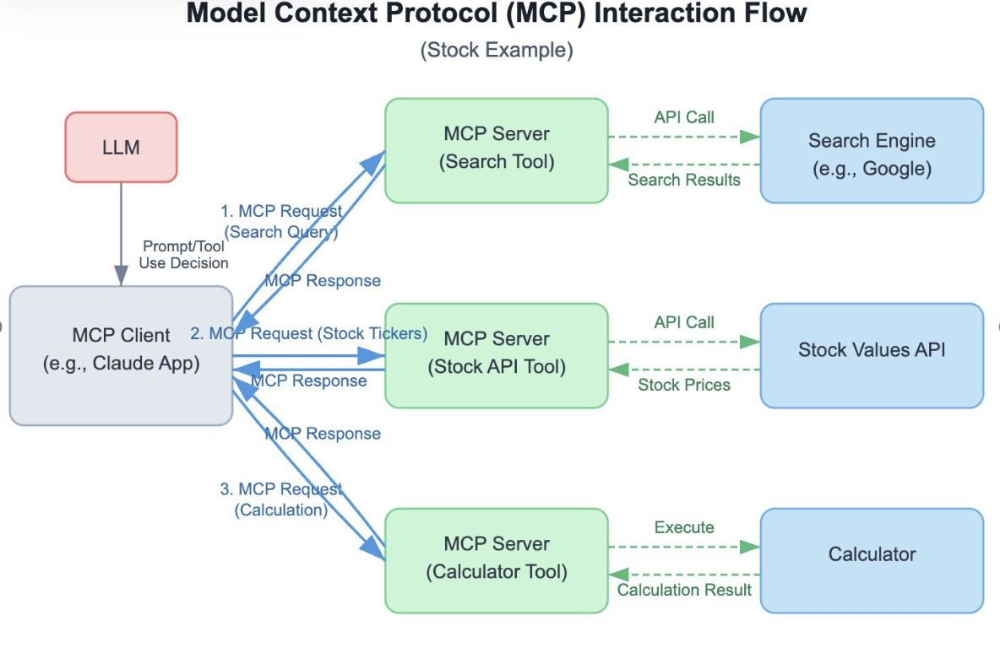

# Model Context Protocol (MCP)



## Overview
This repository demonstrates the implementation of the **Model Context Protocol (MCP)** with various servers (Weather, Math, SQLite) and clients. MCP enables seamless communication between tools and agents using different transports like `stdio` and `SSE`.

---

## Prerequisites
1. **Python**: Ensure Python 3.10+ is installed.
2. **Dependencies**: Install required Python packages:
   ```bash
   pip install -r requirements.txt
   ```
Feel free to add package if needed.

3. **Environment Variables**:
Create a .env file in the root directory.
Add your OpenAI API key
    ```bash
    OPENAI_API_KEY = 'your_openai_api_key_here'
    ```

## Folder Structure

- `test_servers/`: Contains Weather and Math MCP servers and their client.
- `sqlite_server/`: Contains SQLite MCP server and its client.
- `model_instance.py`: Initializes the language model.
- `.env`: Stores environment variables like API keys.
- `test_mcp_sqlite_server.ipynb`: Jupyter Notebook for testing SQLite MCP server.


## How to run
**Weather Server**: 

To start weather server, use command:
   
    python 'path-to-weather-server.py'


**Math server**:
    
Reference to this server will be taken via correct reference path in `test_servers/client.py` file


**SQLite Server**:

Reference to this server will be taken via correct reference path in `sqlite_server/client.py` file


## Testing MCP server

Update the test_content variable to `test` or `sqlite` to test either of the two set of tools.  

Once the test_content is set, run test.py file through terminal. You can also explore `test_mcp_notebook.ipynb` jupyter notebook as test run. 


## Notes
- Ensure the server is running before connecting with the client.
- For SQLite, file need to be added separately to path: `sqlite_server/sql_db.db`
